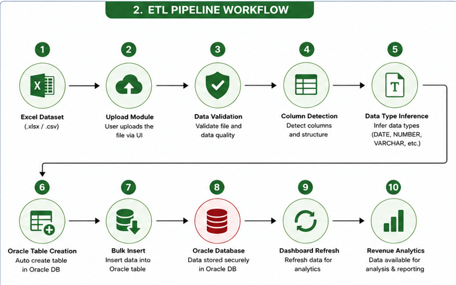
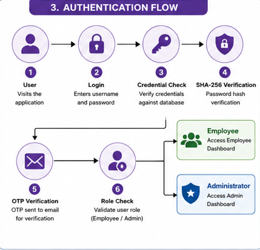
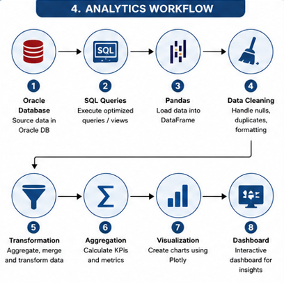
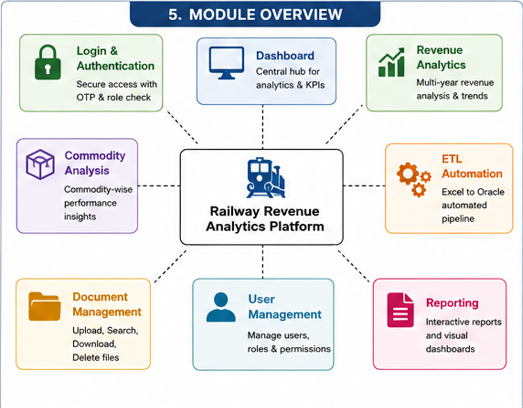

<!--# 🚂 Railway Revenue Analytics & User Management System

A full-stack Streamlit-based web application developed during my internship at **Western Railway – Zonal IT Centre, Churchgate, Mumbai**. This system is designed to assist with **revenue analytics**, **document management**, and **role-based user control** over freight data dashboards.

---

## 🎯 Project Overview

This project was built to support the **Indian Railways IT team** in analyzing apportioned freight revenue, automating data upload to Oracle DB, and managing user access securely.

### 🔧 Modules & Features

#### 📊 Revenue & Freight Data Analytics (Data Engineering + Visualization)
- Multi-year trend analysis of commodity-wise freight revenue.
- Dynamic visualization using **Plotly**, backed by **Oracle SQL queries**.
- Year/month dropdowns for filtering, comparisons, and insights generation.

#### 🔒 Role-Based User Management (Full-Stack Development)
- Secure login/signup with **SHA256 password hashing**.
- OTP-based password reset via **email (SMTP integration)**.
- Admin access to assign roles (employee/admin) and control page-level access.

#### 📁 Document Upload & Excel to Oracle Integration (Automation + Backend)
- Users can upload, search, download, or delete documents via a Streamlit UI.
- Uploaded Excel sheets are **automatically parsed**, **table structures inferred**, and **tables created in Oracle DB**.
- Handles type inference (DATE, NUMBER, VARCHAR) and bulk inserts.

---

## 💻 Tech Stack

- **Frontend**: Streamlit, HTML/CSS Custom Styling
- **Backend**: Python (Pandas, Regex, Oracledb), Oracle SQL
- **Data Viz**: Plotly, Matplotlib, Seaborn
- **Security**: Hashlib, Email OTP (SMTP), Session State
- **Other**: File handling, Regex, SQL templating

---

## 📁 Project Structure

├── app.py # Entry point - dashboard logic
├── Login_user_management.py # User authentication and permission control
├── Document.py # Document manager and Excel-to-Oracle automation
├── page1.py - page4.py # Various revenue analytics pages
├── queries.txt # SQL logic templates
├── testquery.py # DB credentials and constants

---

## 📜 Certificate

> Internship completed under **Zonal IT Centre, Western Railway**  
> Duration: **30 June 2025 – 25 July 2025**  
> Role: **Intern – Software Developer & Data Analyst**  
>  
> ✅ [View Certificate PDF](link-to-certificate)

---

## 🚀 Getting Started

### Prerequisites

- Oracle Instant Client
- Python 3.8+
- Required packages:
  ```bash
  pip install streamlit oracledb pandas plotly openpyxl
Setup Instructions
Clone the repo:

git clone https://github.com/your-username/railway-analytics.git
cd railway-analytics
Add your Oracle DB credentials in testquery.py.

Start the app:

streamlit run app.py
⚙️ React App Setup (If Applicable)
This project uses Create React App for front-end setup (if running alongside a React UI).

Available Scripts
In the project directory, you can run:

npm start
Runs the app in the development mode.
Open http://localhost:3000 to view it in your browser.
The page will reload if you make edits. You may also see lint errors in the console.

npm test
Launches the test runner in the interactive watch mode.
See more in the testing documentation.

npm run build
Builds the app for production to the build folder.
It correctly bundles React in production mode and optimizes the build for the best performance.

The build is minified, and filenames include hashes.
Your app is ready to be deployed!

npm run eject
Note: this is a one-way operation. Once you eject, you can’t go back!
Ejecting gives you full control over the config files (Webpack, Babel, ESLint, etc.)

📚 Learn More
Create React App Docs

React Docs

Code Splitting

Analyzing the Bundle Size

Progressive Web App

Deployment

Build Fails to Minify-->

# 🚂 Railway Revenue Analytics Platform

### Enterprise Freight Revenue Analytics, ETL Automation & User Management System


---

## 📌 Overview

The **Railway Revenue Analytics Platform** is an enterprise-grade analytics application developed during my internship at **Western Railway – Zonal IT Centre, Churchgate, Mumbai**.

The platform was designed to automate freight revenue reporting, streamline Excel-to-Oracle ETL workflows, provide secure role-based access, and enable operational teams to analyze multi-year freight revenue through interactive dashboards.

Developed using **Python, Oracle SQL, Streamlit, Plotly, and Oracle Database**, the application combines data engineering, business intelligence, automation, and user management into a unified platform for operational reporting.

---

# 🎯 Business Problem

Western Railway generates large volumes of freight revenue data across multiple commodities and reporting periods.

Traditional reporting involved manual Excel processing, repetitive Oracle SQL execution, and fragmented workflows, resulting in:

- Time-consuming report preparation
- Manual data entry
- Repetitive SQL execution
- Limited access control
- Difficulty analyzing historical freight revenue
- Inefficient operational reporting

The objective of this project was to automate these workflows while providing secure, interactive, and data-driven reporting capabilities.

---

# 💡 Solution

The Railway Revenue Analytics Platform provides a centralized solution that enables authorized users to:

- Analyze multi-year freight revenue
- Compare commodity-wise revenue trends
- Automate Excel-to-Oracle data ingestion
- Manage uploaded documents
- Generate interactive dashboards
- Secure access using role-based authentication
- Reduce manual reporting effort through automation

---

# 🏗️ System Architecture


---

# 🔄 ETL Workflow



---

# 🔐 Authentication Flow



---

# 📊 Analytics Workflow



---

# 📁 Module Overview



---

# ✨ Key Features

## 📊 Freight Revenue Analytics

- Multi-year freight revenue analysis
- Commodity-wise revenue comparison
- Interactive Plotly dashboards
- Dynamic year and month filtering
- Trend visualization
- Revenue insights using Oracle SQL queries

---

## ⚙️ Automated ETL Pipeline

- Upload Excel datasets
- Automatic schema detection
- Dynamic Oracle table creation
- Bulk data insertion
- Data type inference
- Automated ETL workflow

Supported Data Types

- VARCHAR
- NUMBER
- DATE

---

## 🔒 User Authentication & Security

- Secure Login
- SHA-256 Password Hashing
- OTP Password Reset
- Email Verification
- Session Management
- Role-Based Access Control

User Roles

- Administrator
- Employee

---

## 📁 Document Management

Users can

- Upload documents
- Search files
- Download files
- Delete files
- Manage project documents

---

## 📈 Interactive Dashboards

The platform provides visual dashboards for

- Freight Revenue
- Commodity Performance
- Revenue Trends
- Historical Analysis
- Comparative Reporting

---

# 🏗 System Modules

```
Authentication
│
├── Login
├── Signup
├── OTP Verification
└── Password Reset

Analytics
│
├── Dashboard
├── Revenue Analytics
├── Commodity Analysis
└── Trend Analysis

ETL
│
├── Upload Excel
├── Parse Dataset
├── Create Oracle Tables
└── Insert Records

Document Management
│
├── Upload
├── Download
├── Search
└── Delete

Administration
│
├── User Management
├── Role Management
└── Access Control
```

---

# 🛠 Technology Stack

| Category | Technologies |
|------------|------------------------------|
| Frontend | Streamlit, HTML, CSS |
| Backend | Python |
| Database | Oracle Database |
| Query Language | Oracle SQL |
| Visualization | Plotly, Matplotlib |
| Data Processing | Pandas |
| Authentication | Hashlib, SMTP, Session State |
| Automation | ETL Pipeline |
| Version Control | Git, GitHub |

---

# 🔄 System Workflow

```
Excel Files
        │
        ▼
Data Validation
        │
        ▼
Schema Detection
        │
        ▼
Oracle Database
        │
        ▼
Oracle SQL Queries
        │
        ▼
Python Backend
        │
        ▼
Streamlit Dashboard
        │
        ▼
Interactive Analytics
```

---

# 📊 Business Impact

This solution was developed to improve operational reporting by

- Automating Excel-to-Oracle data ingestion
- Reducing repetitive manual reporting
- Centralizing freight revenue analytics
- Strengthening access control
- Improving reporting accuracy
- Supporting faster operational decision-making

---

# 📂 Repository Structure

```
Railway-Revenue-Analytics-Platform/

│
├── Document.py
├── Login_user_management.py
├── data_entry.py
├── db_utils.py
├── download_data.py
├── fetch_db.py
├── list_db.py
├── pull_db.py
├── table_creation.py
├── page1.py
├── page2.py
├── pages3.py
├── pages4.py
├── queries.txt
├── run_streamlit.bat
├── package.json
├── server.js
├── src/
├── public/
└── README.md
```

---

# 🚀 Installation

## Prerequisites

- Python 3.10+
- Oracle Instant Client
- Oracle Database
- Node.js (for frontend components)

Install dependencies

```bash
pip install streamlit pandas plotly openpyxl oracledb
```

Run

```bash
streamlit run app.py
```

---

# 🔐 Security & Confidentiality

This repository is a portfolio representation of the project developed during my internship at **Western Railway – Zonal IT Centre**.

To protect organizational confidentiality:

- Internal datasets have been removed.
- Database credentials have been excluded.
- Sensitive business information has not been published.
- The repository focuses solely on the technical implementation and architecture.

---

# 📚 Internship Information

**Organization**

Western Railway – Zonal IT Centre

**Role**

Software Developer & Data Analyst Intern

**Duration**

30 June 2025 – 25 July 2025

---

# 🔮 Future Enhancements

- Power BI Integration
- Predictive Revenue Forecasting
- REST API Development
- Docker Deployment
- Cloud Hosting
- CI/CD Pipeline
- Advanced KPI Dashboards
- Mobile Responsive UI
- AI-Based Revenue Forecasting

---

# 👨‍💻 Author

**Rudra Save**

Electronics & Telecommunication Engineering Student

Aspiring Data Analyst | Business Analyst | Power BI Developer

GitHub: https://github.com/rudrasave

LinkedIn: *(Add your LinkedIn URL here)*

---

## ⭐ If you found this project interesting, consider giving it a Star!

📬 Connect With Me
LinkedIn: Your LinkedIn Profile
